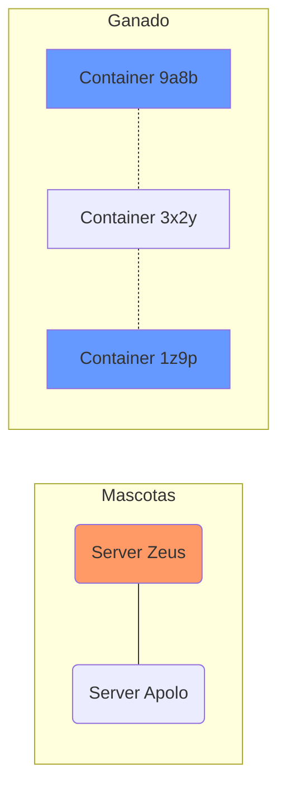
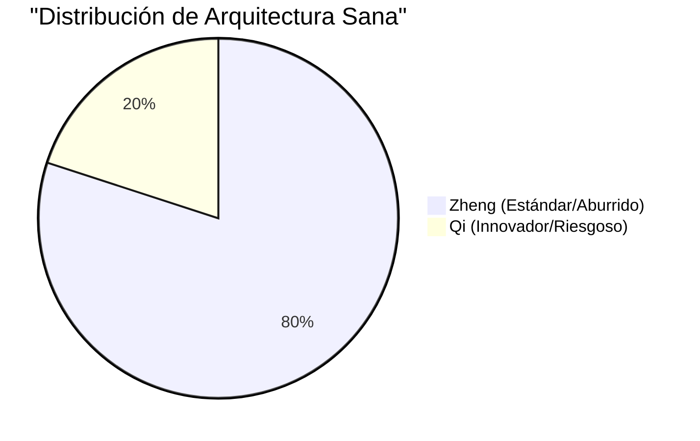
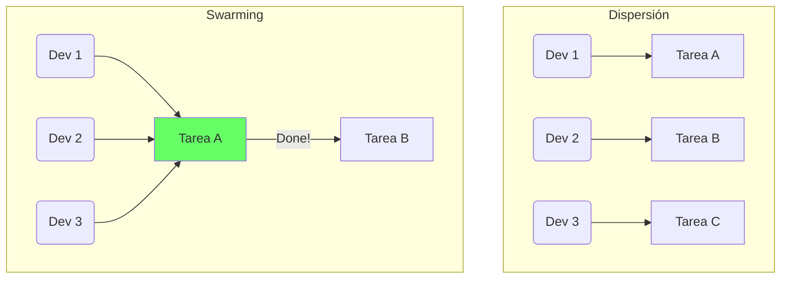

# GRÁFICOS M2

## Tema 2.1: Mascotas vs Ganado

```mermaid
graph LR
    subgraph Pets [Mascotas <Tradicional>]
        S1(Server Zeus) --- S2(Server Apolo)
        style S1 fill:#f96
    end

    subgraph Cattle [Ganado <Cloud>]
        C1[Container 9a8b] -.- C2[Container 3x2y] -.- C3[Container 1z9p]
        style C1 fill:#69f
        style C3 fill:#69f
    end
```

## Tema 2.2: Zheng vs Qi (Distribución 80/20)

```mermaid
pie title "Distribución de Arquitectura Sana"
    "Zheng (Estándar/Aburrido)" : 80
    "Qi (Innovador/Riesgoso)" : 20
```

## Tema 2.3: Swarming (Concentración de Fuerza)

```mermaid
graph TD
    subgraph Escenario_Malo [Dispersión]
        D1(Dev 1) --> T1[Tarea A]
        D2(Dev 2) --> T2[Tarea B]
        D3(Dev 3) --> T3[Tarea C]
    end

    subgraph Escenario_Bueno [Swarming]
        D4(Dev 1) --> TA[Tarea A]
        D5(Dev 2) --> TA
        D6(Dev 3) --> TA
        TA --> |Done!| TB[Tarea B]
    end

    style TA fill:#6f6
```
