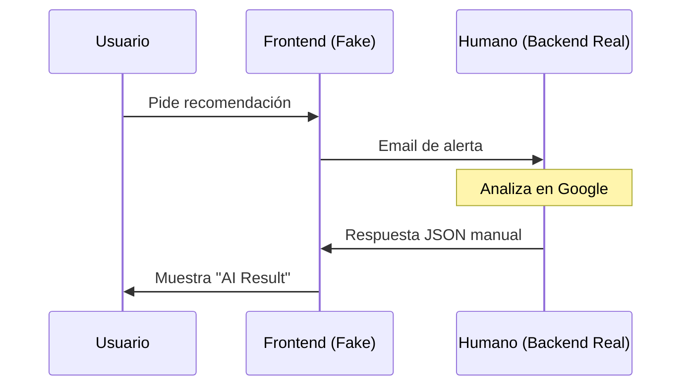
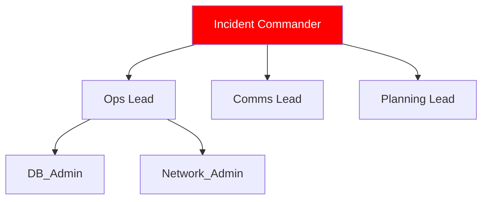

# GRÁFICOS M3

## Tema 3.1: Maniobra (Mago de Oz)

```mermaid
sequenceDiagram
    participant U as Usuario
    participant F as Frontend (Fake)
    participant H as Humano (Backend Real)

    U->>F: Pide recomendación
    F->>H: Email de alerta
    Note over H: Analiza en Google
    H->>F: Respuesta JSON manual
    F->>U: Muestra "AI Result"
```

## Tema 3.2: Trace Distribuido

```mermaid
gantt
    title Trace ID: abc-123 (Cascada de Latencia)
    dateFormat X
    axisFormat %s

    section Frontend
    Auth Check :a1, 0, 50
    section Backend
    Process Logic :a2, 50, 80
    section Database
    SQL Query (Lento) :crit, a3, 80, 500
    section Response
    Send JSON :a4, 500, 510
```

## Tema 3.3: Incident Command System

```mermaid
graph TD
    IC[Incident Commander] --> Ops[Ops Lead]
    IC --> Comms[Comms Lead]
    IC --> Planning[Planning Lead]

    Ops --> DB_Admin
    Ops --> Network_Admin

    style IC fill:#f00,color:#fff
```
