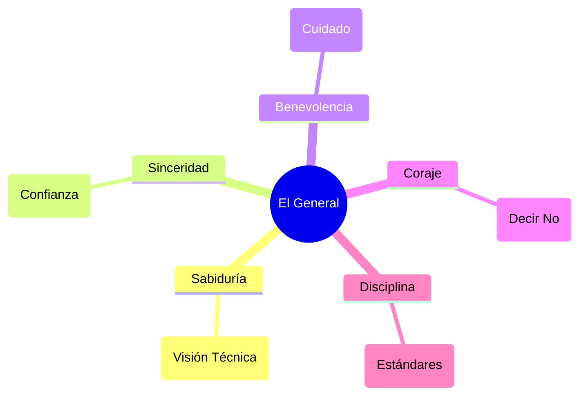
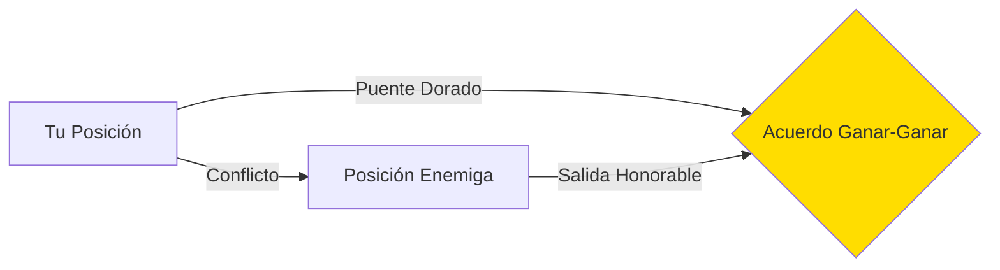

# GRÁFICOS M4

## Tema 4.1: Las 5 Virtudes

```mermaid
mindmap
  root((El General))
    Sabiduría
      (Visión Técnica)
    Sinceridad
      (Confianza)
    Benevolencia
      (Cuidado)
    Coraje
      (Decir No)
    Disciplina
      (Estándares)
```

## Tema 4.2: El Puente Dorado (Negociación)

```mermaid
graph LR
    A[Tu Posición] -- Conflicto --> B[Posición Enemiga]
    A -- Puente Dorado --> C{Acuerdo Ganar-Ganar}
    B -- Salida Honorable --> C

    style C fill:#fd0
```
