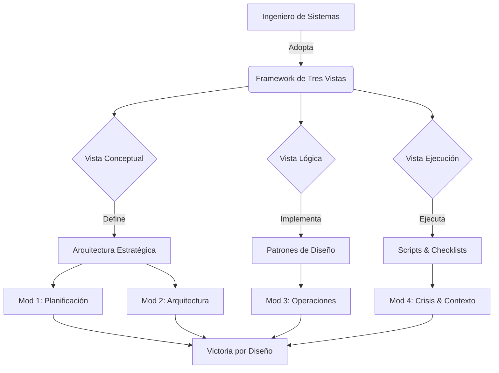

# ARQUITECTURA CURRICULAR: SUN TZU EN PRODUCTION

## METADATA

- **Complejidad**: Alta
- **Duración estimada**: 25 Horas
- **Audiencia objetivo**: Ingenieros de Sistemas, Tech Leads, Arquitectos, Engineering Managers, DevOps/SRE
- **Prerrequisitos obligatorios**:
  1. Mentalidad de sistemas y procesos
  2. Experiencia con desafíos técnicos complejos
  3. Disposición a pensar en múltiples niveles de abstracción
- **Fecha de diseño**: 2024-05-21

## MAPA CONCEPTUAL



## OBJETIVOS GENERALES DEL CURSO

1. **Sistematizar la Intuición**: Convertir la experiencia empírica en un framework repetible de toma de decisiones.
2. **Dominar el Framework de Tres Vistas**: Aplicar Concepto, Lógica y Ejecución a desafíos no técnicos.
3. **Gestión de Crisis y Conflicto**: Utilizar tácticas probadas para navegar incidentes de producción y bloqueos organizacionales.
4. **Diseño Antifrágil**: Arquitectar sistemas y equipos que se beneficien de la volatilidad y el estrés.
5. **Liderazgo Técnico Estratégico**: Alinear las decisiones de ingeniería con los objetivos macro del negocio ("El Soberano").

## ESTRUCTURA MODULAR

### MÓDULO 0: DIAGNÓSTICO Y NIVELACIÓN - FUNDAMENTOS COGNITIVOS

**Duración**: 2 Horas
**Objetivo**: Instalar el sistema operativo mental del "Ingeniero Estratégico" y nivelar el lenguaje con el Framework de Tres Vistas.

#### TEMA 0.1: El Ingeniero como Estratega Natural

**Objetivo**: Desmitificar la estrategia y conectarla con el pensamiento sistémico.

- **Subtema 0.1.1**: De la Compilación a la Conquista
  - _Objetivo_: Reconocer patrones estratégicos en problemas de ingeniería diarios.
  - _Tipo_: Teórico (Analogías).
- **Subtema 0.1.2**: El Costo de la No-Estrategia (Deuda Técnica vs Deuda Estratégica)
  - _Objetivo_: Calcular el impacto de decisiones tácticas aisladas.
  - _Tipo_: Estudio de Caso.

#### TEMA 0.2: El Framework de Tres Vistas (Installation Guide)

**Objetivo**: Explicar y configurar la herramienta central del curso.

- **Subtema 0.2.1**: Vista Conceptual (Diagramas de Arquitectura Estratégica)
  - _Objetivo_: Aprender a diagramar problemas humanos/organizacionales.
  - _Tipo_: Teórico/Práctico.
- **Subtema 0.2.2**: Vista Lógica (Patrones de Diseño)
  - _Objetivo_: Introducción al catálogo de patrones (Singleton, Observer, etc. aplicados a estrategia).
  - _Tipo_: Teórico.
- **Subtema 0.2.3**: Vista de Ejecución (Runbooks)
  - _Objetivo_: Estructura de un checklist estratégico.
  - _Tipo_: Práctico.

---

### MÓDULO 1: ANÁLISIS Y PLANIFICACIÓN ESTRATÉGICA

**Duración**: 5 Horas
**Objetivo**: Evaluar viabilidad de proyectos y diseñar planes de ejecución infalibles (Capítulos 1-3).

#### TEMA 1.1: El Modelo de 5-Factores (Viabilidad de Proyecto)

**Objetivo**: Adaptar el `道, 天, 地, 將, 法` al análisis de requisitos y health-check de proyectos.

- **Subtema 1.1.1**: Tao (Propósito) y Clima (Timing/Mercado)
  - _Objetivo_: Evaluar alineación de negocio y ventana de oportunidad.
  - _Tipo_: Análisis de Caso.
- **Subtema 1.1.2**: Terreno (Infra), Liderazgo (Team) y Método (Procesos)
  - _Objetivo_: Audit de capacidades técnicas y operativas.
  - _Tipo_: Checklist/Auditoría.

#### TEMA 1.2: Economía del Cycle Time (Logística)

**Objetivo**: Entender la guerra (proyecto) como un problema logístico de recursos y tiempo.

- **Subtema 1.2.1**: El Costo de la Guerra Prolongada
  - _Objetivo_: Calcular el burn-rate real y la fatiga del equipo.
  - _Tipo_: Teórico/Matemático.
- **Subtema 1.2.2**: Automatización como Multiplicador de Logística
  - _Objetivo_: Estrategias de CI/CD para reducir fricción.
  - _Tipo_: Estrategia Técnica.

#### TEMA 1.3: Resolver en Capas (Estrategia Ofensiva)

**Objetivo**: Ganar sin combatir (destrucción) mediante posicionamiento superior.

- **Subtema 1.3.1**: El Árbol de Decisión de Conflicto
  - _Objetivo_: Elegir la capa de intervención (Diseño, Código, Persona).
  - _Tipo_: Árbol de Decisión.
- **Subtema 1.3.2**: Ganar por Diseño (Architecture wins)
  - _Objetivo_: Resolver problemas políticos con soluciones técnicas indiscutibles.
  - _Tipo_: Patrón de Diseño.

---

### MÓDULO 2: ARQUITECTURA DE SISTEMAS ESTRATÉGICOS

**Duración**: 6 Horas
**Objetivo**: Diseñar sistemas y equipos invencibles y eficientes (Capítulos 4-6).

#### TEMA 2.1: Diseño Anti-frágil (Invencibilidad)

**Objetivo**: Asegurar la defensa antes de buscar la ofensiva (`軍形`).

- **Subtema 2.1.1**: Defensa primero: Immutable Infrastructure
  - _Objetivo_: Crear bases que no pueden se "rotas" por cambios externos.
  - _Tipo_: Concepto Arquitectónico.
- **Subtema 2.1.2**: Capacidad de Error (Error Budgeting)
  - _Objetivo_: Usar el presupuesto de error como recurso estratégico.
  - _Tipo_: Gestión SRE.

#### TEMA 2.2: Orquestación (Momentum)

**Objetivo**: Gestionar la energía potencial y cinética del equipo (`兵勢`).

- **Subtema 2.2.1**: Direct Methods vs Indirect Methods (Ortodoxo vs Heterodoxo)
  - _Objetivo_: Combinar estándares (REST, SQL) con innovación (AI, Edge) para sorpresa.
  - _Tipo_: Estrategia de Innovación.
- **Subtema 2.2.2**: Momentum de Release
  - _Objetivo_: Mantener la cadencia de entrega para moral alta.
  - _Tipo_: Gestión de Proyecto.

#### TEMA 2.3: Sharding de Atención (Concentración)

**Objetivo**: Gestión de recursos limitados frente a demandas infinitas (`虛實`).

- **Subtema 2.3.1**: Identificar Vacíos y Plenitudes (Bloat vs Lean)
  - _Objetivo_: Atacar la deuda técnica donde es débil, evitar refactors masivos.
  - _Tipo_: Táctica de Refactoring.
- **Subtema 2.3.2**: Concentración de Fuerza (Swarming)
  - _Objetivo_: Técnicas de pair/mob programming para problemas críticos.
  - _Tipo_: Gestión de Equipo.

---

### MÓDULO 3: OPERACIONES Y TÁCTICAS

**Duración**: 6 Horas
**Objetivo**: Ejecución adaptativa y manejo de fricción en tiempo real (Capítulos 7-9).

#### TEMA 3.1: Gestión del Momentum (Maniobra)

**Objetivo**: Convertir la planificación en movimiento fluido (`軍爭`).

- **Subtema 3.1.1**: Rutas Directas e Indirectas
  - _Objetivo_: MVP vs Solución Final (el camino tortuoso).
  - _Tipo_: Planificación de Roadmaps.
- **Subtema 3.1.2**: El Arte del Desvío (Feature Flags)
  - _Objetivo_: Comprar tiempo y opciones en producción.
  - _Tipo_: Patrón Técnico.

#### TEMA 3.2: 9 Heurísticas de Incidencias (Variables)

**Objetivo**: Adaptación rápida ante cambios inesperados (`九變`).

- **Subtema 3.2.1**: Clasificando la Anomalía
  - _Objetivo_: Framework Cynefin aplicado a incidentes.
  - _Tipo_: Triage.
- **Subtema 3.2.2**: Protocolos de "No ir"
  - _Objetivo_: Saber cuándo NO desplegar o NO arreglar (Rollback).
  - _Tipo_: Toma de Decisiones.

#### TEMA 3.3: Logística Adaptativa (Marchas)

**Objetivo**: Operar en diferentes entornos y escalas (`行軍`).

- **Subtema 3.3.1**: Lectura de Señales (Observabilidad)
  - _Objetivo_: Interpretar logs y métricas como "señales del enemigo/terreno".
  - _Tipo_: Monitoreo.
- **Subtema 3.3.2**: Posicionamiento en Terreno Alto
  - _Objetivo_: Controlar las abstracciones clave del sistema.
  - _Tipo_: Arquitectura.

---

### MÓDULO 4: CONTEXTOS ESPECIALES Y CRISIS

**Duración**: 4 Horas
**Objetivo**: Navegar entornos hostiles, políticos y crisis graves (Capítulos 10-13).

#### TEMA 4.1: Los 6 Terrenos Organizacionales

**Objetivo**: Mapear topologías de equipo y organización (`地形`, `九地`).

- **Subtema 4.1.1**: Terrenos Dispersos a Mortales
  - _Objetivo_: Diagnosticar disfunción organizacional (Silos, Burnout).
  - _Tipo_: Diagnóstico Organizacional.
- **Subtema 4.1.2**: Tácticas de Unificación
  - _Objetivo_: Alinear equipos fracturados.
  - _Tipo_: Liderazgo.

#### TEMA 4.2: Gestión de Incendios (Ataque por Fuego)

**Objetivo**: Uso destructivo y constructivo de crisis (`火攻`).

- **Subtema 4.2.1**: Firefighting Efectivo
  - _Objetivo_: Roles y comunicación durante P0 incidents.
  - _Tipo_: Protocolo de Emergencia.
- **Subtema 4.2.2**: Chaos Engineering (Fuego Controlado)
  - _Objetivo_: Provocar crisis para endurecer el sistema.
  - _Tipo_: Práctica Técnica.

#### TEMA 4.3: Sistemas de Inteligencia (Espías)

**Objetivo**: Información como activo primario (`用間`).

- **Subtema 4.3.1**: Tipos de Agentes (Feedback Loops)
  - _Objetivo_: Construir una red de inteligencia completa.
  - _Tipo_: Diseño de Sistemas.
- **Subtema 4.3.2**: La Verdad del Enemigo
  - _Objetivo_: Entender sistemas heredados o de terceros sin documentación.
  - _Tipo_: Investigación Técnica.

---

### MÓDULO FINAL: EL PLAYBOOK DEL INGENIERO ESTRATÉGICO

**Duración**: 2 Horas
**Objetivo**: Integración final y plan personal.

#### TEMA 5.1: Integración de Patrones

**Objetivo**: Simulacro final de aplicación del framework completo.

- **Subtema 5.1.1**: El War Room Simulado
  - _Objetivo_: Escenario complejo que requiere las 3 Vistas.
  - _Tipo_: Ejercicio Integrador.

#### TEMA 5.2: Toolkit Personalizado

**Objetivo**: Compilación de artefactos.

- **Subtema 5.2.1**: Construyendo tu "Art of War" tech stack
  - _Objetivo_: Selección de herramientas y checklists.
  - _Tipo_: Personalización.

---

## JSON ESTRUCTURA CURRICULAR

```json
[
  {
    "modulo_id": 0,
    "titulo": "Diagnóstico y Nivelación - Fundamentos Cognitivos",
    "temas": [
      {
        "tema_id": "0.1",
        "titulo": "El Ingeniero como Estratega Natural",
        "subtemas": [
          {
            "subtema_id": "0.1.1",
            "titulo": "De la Compilación a la Conquista"
          },
          { "subtema_id": "0.1.2", "titulo": "El Costo de la No-Estrategia" }
        ]
      },
      {
        "tema_id": "0.2",
        "titulo": "El Framework de Tres Vistas",
        "subtemas": [
          { "subtema_id": "0.2.1", "titulo": "Vista Conceptual" },
          { "subtema_id": "0.2.2", "titulo": "Vista Lógica" },
          { "subtema_id": "0.2.3", "titulo": "Vista de Ejecución" }
        ]
      }
    ]
  },
  {
    "modulo_id": 1,
    "titulo": "Análisis y Planificación Estratégica",
    "temas": [
      {
        "tema_id": "1.1",
        "titulo": "El Modelo de 5-Factores",
        "subtemas": [
          {
            "subtema_id": "1.1.1",
            "titulo": "Tao (Propósito) y Clima (Timing)"
          },
          { "subtema_id": "1.1.2", "titulo": "Terreno, Liderazgo y Método" }
        ]
      },
      {
        "tema_id": "1.2",
        "titulo": "Economía del Cycle Time",
        "subtemas": [
          {
            "subtema_id": "1.2.1",
            "titulo": "El Costo de la Guerra Prolongada"
          },
          {
            "subtema_id": "1.2.2",
            "titulo": "Automatización como Multiplicador"
          }
        ]
      },
      {
        "tema_id": "1.3",
        "titulo": "Resolver en Capas",
        "subtemas": [
          {
            "subtema_id": "1.3.1",
            "titulo": "El Árbol de Decisión de Conflicto"
          },
          { "subtema_id": "1.3.2", "titulo": "Ganar por Diseño" }
        ]
      }
    ]
  },
  {
    "modulo_id": 2,
    "titulo": "Arquitectura de Sistemas Estratégicos",
    "temas": [
      {
        "tema_id": "2.1",
        "titulo": "Diseño Anti-frágil",
        "subtemas": [
          {
            "subtema_id": "2.1.1",
            "titulo": "Defensa primero: Immutable Infrastructure"
          },
          {
            "subtema_id": "2.1.2",
            "titulo": "Capacidad de Error (Error Budgeting)"
          }
        ]
      },
      {
        "tema_id": "2.2",
        "titulo": "Orquestación (Momentum)",
        "subtemas": [
          {
            "subtema_id": "2.2.1",
            "titulo": "Direct Methods vs Indirect Methods"
          },
          { "subtema_id": "2.2.2", "titulo": "Momentum de Release" }
        ]
      },
      {
        "tema_id": "2.3",
        "titulo": "Sharding de Atención",
        "subtemas": [
          {
            "subtema_id": "2.3.1",
            "titulo": "Identificar Vacíos y Plenitudes"
          },
          { "subtema_id": "2.3.2", "titulo": "Concentración de Fuerza" }
        ]
      }
    ]
  },
  {
    "modulo_id": 3,
    "titulo": "Operaciones y Tácticas",
    "temas": [
      {
        "tema_id": "3.1",
        "titulo": "Gestión del Momentum",
        "subtemas": [
          { "subtema_id": "3.1.1", "titulo": "Rutas Directas e Indirectas" },
          {
            "subtema_id": "3.1.2",
            "titulo": "El Arte del Desvío (Feature Flags)"
          }
        ]
      },
      {
        "tema_id": "3.2",
        "titulo": "9 Heurísticas de Incidencias",
        "subtemas": [
          { "subtema_id": "3.2.1", "titulo": "Clasificando la Anomalía" },
          { "subtema_id": "3.2.2", "titulo": "Protocolos de No ir" }
        ]
      },
      {
        "tema_id": "3.3",
        "titulo": "Logística Adaptativa",
        "subtemas": [
          { "subtema_id": "3.3.1", "titulo": "Lectura de Señales" },
          { "subtema_id": "3.3.2", "titulo": "Posicionamiento en Terreno Alto" }
        ]
      }
    ]
  },
  {
    "modulo_id": 4,
    "titulo": "Contextos Especiales y Crisis",
    "temas": [
      {
        "tema_id": "4.1",
        "titulo": "Los 6 Terrenos Organizacionales",
        "subtemas": [
          { "subtema_id": "4.1.1", "titulo": "Terrenos Dispersos a Mortales" },
          { "subtema_id": "4.1.2", "titulo": "Tácticas de Unificación" }
        ]
      },
      {
        "tema_id": "4.2",
        "titulo": "Gestión de Incendios",
        "subtemas": [
          { "subtema_id": "4.2.1", "titulo": "Firefighting Efectivo" },
          { "subtema_id": "4.2.2", "titulo": "Chaos Engineering" }
        ]
      },
      {
        "tema_id": "4.3",
        "titulo": "Sistemas de Inteligencia",
        "subtemas": [
          {
            "subtema_id": "4.3.1",
            "titulo": "Tipos de Agentes (Feedback Loops)"
          },
          { "subtema_id": "4.3.2", "titulo": "La Verdad del Enemigo" }
        ]
      }
    ]
  },
  {
    "modulo_id": 5,
    "titulo": "Playbook del Ingeniero Estratégico",
    "temas": [
      {
        "tema_id": "5.1",
        "titulo": "Integración de Patrones",
        "subtemas": [
          { "subtema_id": "5.1.1", "titulo": "El War Room Simulado" }
        ]
      },
      {
        "tema_id": "5.2",
        "titulo": "Toolkit Personalizado",
        "subtemas": [
          { "subtema_id": "5.2.1", "titulo": "Construyendo tu Art of War" }
        ]
      }
    ]
  }
]
```
